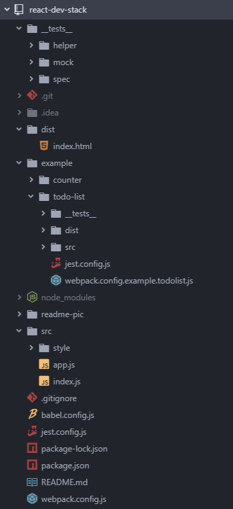

### 0. 项目结构


### 1. 安装webpak和babel依赖
#### 1.1 开发依赖
```json
"devDependencies": {
  "@babel/cli": "^7.6.4",
  "@babel/core": "^7.6.4",
  "@babel/preset-env": "^7.6.3",
  "@babel/preset-react": "^7.6.3",
  // 解释ES6中class使用箭头函数做属性
  "@babel/plugin-proposal-class-properties": "^7.5.5",
  // webpack打包JS文件
  "babel-loader": "^8.0.6",
  // webpack打包class文件
  "css-loader": "^3.2.0",
  "style-loader": "^1.0.0",

  "webpack": "^4.41.2",
  "webpack-cli": "^3.3.10",
  "webpack-dev-server": "^3.9.0"
}
```

#### 1.2 babel.config.js
```javascript
const presets = [["@babel/env", { useBuiltIns: false }], ["@babel/react"]];

const plugins = [["@babel/plugin-proposal-class-properties"]];

module.exports = { presets, plugins };
```

#### 1.3 webpack.config.js
```javascript
const path = require("path");

const config = {
  // 打包的入口文件
  entry: "./src/index.js",
  // 打包输出的目录和文件夹
  output: {
    filename: "bundle.js",
    path: path.resolve(__dirname, "dist")
  },

  mode: "development",
  // 打包监听
  watch: false,
  watchOptions: {
    ignored: /node_modules/,
    aggregateTimeout: 2000
  },

  module: {
    rules: [
      // JS 加载配置
      {
        test: /\.js/,
        use: ["babel-loader"],
        exclude: /(node_modules|bower_components)/
      },
      // CSS 加载配置
      {
        test: /\.css/,
        use: ["style-loader", "css-loader"],
        exclude: /(node_modules|bower_components)/
      }
    ]
  },
  devtool: "inline-source-map",
  // webpack-dev-server 对webpack服务的配置
  devServer: {
    contentBase: "./dist",
    host: "localhost",
    port: 8888
  }
};

module.exports = config;
```

### 2. 安装React相关的配置
#### 2.1 react依赖
```json
"dependencies": {
  "react": "^16.11.0",
  "react-dom": "^16.11.0",
  "react-redux": "^6.0.0",
  "redux": "^4.0.1"
},
```

#### 2.2 配置运行打包命令
**package.json：**
```json
"scripts": {
  "build": "webpack --config webpack.config.js",
  "start": "webpack-dev-server --open"
}
```

#### 2.3 检验运行  
**src/index.js：**
```javascript
/****** redux 相关配置 *****
import {createStore} from "redux";
import {Provider} from "react-redux";
import reducer from "./reducer";
const store = createStore(reducer);
const app = (
    <Provider store={store}>
        <App/>
    </Provider>
);
*/
import React from "react";
import ReactDOM from "react-dom";
import App from "./app";

ReactDOM.render(<App />, document.getElementById("root"));
```

**src/app.js：**
```javascript
import React, { Component } from "react";
import "./style/app.css";

export default class App extends Component {
  constructor(props) {
    super(props);
  }
  render() {
    return (
      <div>
        <h1>Hello React!</h1>
      </div>
    );
  }
}
```

**dist/index.html：**
```html
<!DOCTYPE html>
<html lang="en" dir="ltr">
  <head>
    <meta charset="utf-8" />
    <title>React</title>
  </head>
  <body>
    <div id="root"></div>
    <script type="text/javascript" src="bundle.js"></script>
  </body>
</html>
```

#### 2.4 react router配置
**package.json：**
```json
"dependencies":{
  "react-router-dom": "^5.1.2"
}
```

**webpac.config.js：**
```javascript
// historyApiFallback：配置通过浏览器地址栏访问资源不存在时的
devServer: {
    contentBase: "./dist",
    host: "localhost",
    port: 8888,
    historyApiFallback: true,
    /*** 更细致的配置 ***
    historyApiFallback: {
        rewrites: [
            { from: /^\/hsl\/\d+\/\d+\/\d+/, to: "/index.html" },
            { from: /^\/rgb\/\d+\/\d+\/\d+/, to: "/index.html" },
            { from: /./, to: "/404.html" }
        ]
    }
    */
}
```


### 3. 配置Jest+Enzyme的测试环境
#### 3.1 添加依赖
```json
"devDependencies": {
  "enzyme": "^3.10.0",
  "enzyme-adapter-react-16": "^1.15.1",
  "jest": "^24.9.0",
  "jest-enzyme": "^7.1.2",
  "redux-mock-store": "^1.5.3"
}
```

#### 3.2 配置文件
**jest.config.js：**
```javascript
// 使用 jset --init 命令生成配置文件
// <rootDir> 指该配置文件所在目录
module.exports = {
  // Automatically clear mock calls and instances between every test
  clearMocks: true,
  // The directory where Jest should output its coverage files
  coverageDirectory: "coverage",
  // An array of directory names to be searched recursively up from the requiring module's location
  moduleDirectories: ["node_modules"],
  // A map from regular expressions to module names that allow to stub out resources with a single module
  moduleNameMapper: {
    //将jpg,png等图像文件映射成fileMock.js文件所export的模块
    "\\.(jpg|jpeg|png|gif|eot|otf|webp|svg|ttf|woff|woff2|mp4|webm|wav|mp3|m4a|aac|oga)$":"<rootDir>/__tests__/mock/file.mock.js",
    //将css文件映射成styleMock.js文件所export的模块
    "\\.(css|less)$": "<rootDir>/__tests__/mock/style.mock.js"
  },
  // The paths to modules that run some code to configure or set up the testing environment before each test
  setupFiles: ["<rootDir>/__tests__/helper/jsdom.setup.js"],
  // A list of paths to modules that run some code to configure or set up the testing framework before each test
  setupFilesAfterEnv: [
    "<rootDir>/__tests__/helper/enzyme.setup.js",
    "<rootDir>/node_modules/jest-enzyme/lib/index.js"
  ],
  // The test environment that will be used for testing
  testEnvironment: "jest-environment-jsdom",

  // The glob patterns Jest uses to detect test files
  testMatch: [
    "<rootDir>/__tests__/spec/**/*.spec.js"
  ],
  // An array of regexp pattern strings that are matched against all test paths, matched tests are skipped
  testPathIgnorePatterns: [
    "\\\\node_modules\\\\"
  ],
};
```

**__tests__/helper/enzyme.setup.js：**
```javascript
import { configure } from "enzyme";
import Adapter from "enzyme-adapter-react-16";

configure({ adapter: new Adapter() });
```

**__tests__/helper/jsdom.setup.js：**
```javascript
import { JSDOM } from "jsdom";

const dom = new JSDOM("<html><body></body></html>");
global.window = dom.window;
global.document = dom.window.document;
global.navigator = dom.window.navigator;
```

**__tests__/mock/style.mock.js && __tests__/mock/file.mock.js：**
```javascript
// __tests__/mock/style.mock.js
module.exprots = {};

// __tests__/mock/file.mock.js
module.exports = "mock file";
```

#### 3.3 编写测试
**__tests__\spec\app.spec.js：**
```javascript
import React from "react";
import { shallow, mount } from "enzyme";
import App from "../../src/app";

describe("App", () => {
  it("should render Hello React! header", () => {
    const app = shallow(<App />);
    expect(app.find("h1").text()).toBe("Hello React!");
  });

  it("t1", () => {
    expect(1 + 2).toBe(3);
    expect(1 * 2).not.toBe(3);
  });
})
```

#### 3.4 运行
**package.json：**
```json
"scripts": {
  "test": "jest --config=jest.config.js",
  "jest": "jest --config=jest.config.js --coverage"
}
```
